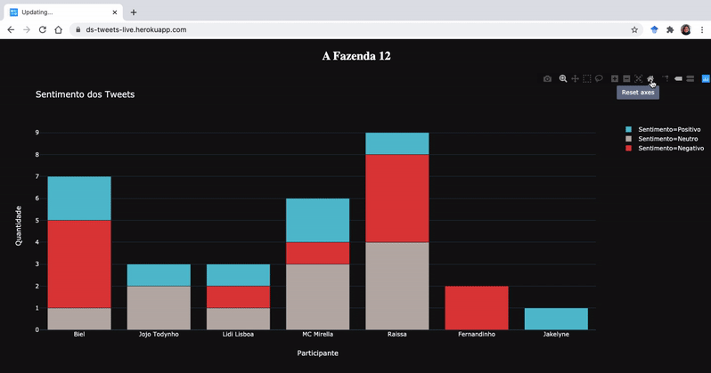

# The Project

This project is a live sentiment classifier of tweets about the Brazilian reality show "A Fazenda". The show recently started (2020-09), and has a high engagement on Twitter through the hashtag #AFazenda12. Our app shows a live analysis of tweets sentiment grouped by participants, classifying if they are most "Positive", "Negative" or "Neutral".

# The classifier

You can check and test our tweet sentiment classifier in Google Colab notebook: https://colab.research.google.com/github/elisasmenendez/ds-tweet-sentiment/blob/master/classifier/pt_tweets_classifier.ipynb

# The app

Our app was deployed on Heroku and is public available at: https://ds-tweets-live.herokuapp.com/

### Heroku vs. Local

Unfortunately, when using Heroku, the chart does not refresh by itself, we have to click in the "reset axes" button to do a refresh. When running locally, the app refreshes by itself, maybe we need to add something to work on Heroku.

# Future Work

There is a lot of room for improvement in this project:
- Improve our classifier by using deep learning models with TensorFlow and Keras
- Improve our classifier by adding more datasets for the experiments
- Improve the app by adding more charts
- Do something more smart with retweets and spamming tweets
- And so on...

# References

To create this project I followed this awesome tutorial by Chulong Li: https://towardsdatascience.com/real-time-twitter-sentiment-analysis-for-brand-improvement-and-topic-tracking-chapter-1-3-e02f7652d8ff

Other useful references were:
- Tweepy: http://docs.tweepy.org/en/latest/streaming_how_to.html
- Shihao Ran Tutorial: https://shihaojran.com/live-twitter-data-analysis-and-visualization-using-python-and-plotly-dash/
- Python Programming Tutorial: https://pythonprogramming.net/twitter-stream-sentiment-analysis-python/
